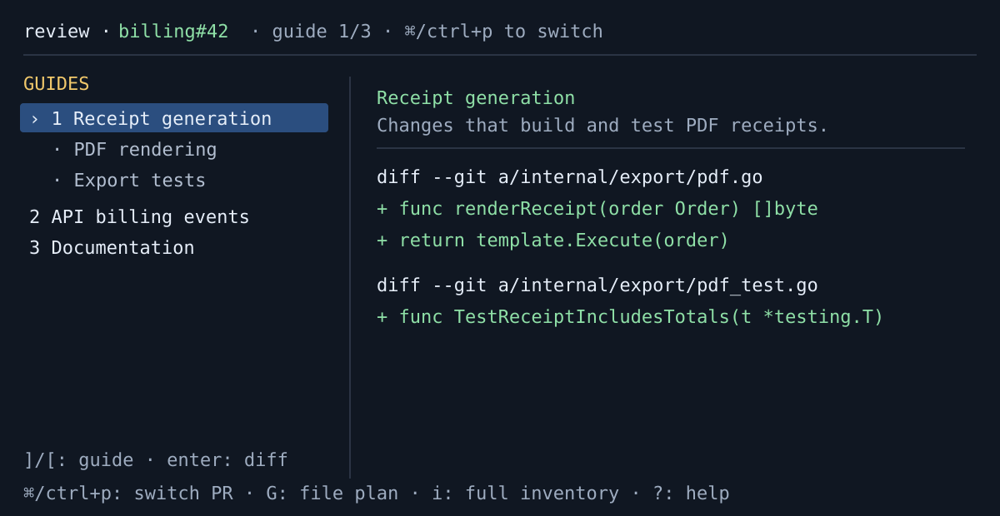

# TODO: Command-Switcher TUI Redesign

Chosen direction: **B — command switcher**. Preserve a full-width diff by
keeping pull-request switching out of the normal review layout. When the
switcher is closed, the left rail presents the existing guide hierarchy; the
selected guide owns the right-side diff context.

## Outcome

A reviewer can press one discoverable key to switch to an already-open PR or
browse another open PR, while guide review remains readable: hierarchy on the
left, guide scope and diff on the right, without a permanent PR browser taking
terminal width.

## Non-negotiable interaction model

- Use a command-switcher overlay for PR discovery and switching. It is closed
  by default and must not reduce the review diff width.
- The review header names the active PR and exposes the switcher shortcut.
- In guide mode, the left pane remains the guide/section hierarchy. Enter
  focuses the selected guide or section in the right diff pane.
- The raw file plan (`G`) and full inventory (`i`) retain their existing
  meaning and remain an explicit fallback from guides.
- Selecting an already-open PR activates its existing in-process review state;
  opening another creates a review tab/session only after the existing
  read-only pinning operation succeeds.
- Preserve process-local state per review: selected row, guide expansion,
  focused pane, inventory/file-plan mode, horizontal/vertical scroll, notices,
  and action errors.

## Proposed keys

| Key | Action |
| --- | --- |
| `ctrl+p` (with `p` fallback if terminal support is unreliable) | Open PR switcher |
| Up/down or `j`/`k` | Move within switcher results |
| Type | Filter already-open and available PRs |
| Enter | Activate an open PR or start opening a selected PR |
| Escape | Close switcher without changing the active review |
| `[` / `]` | Previous / next guide |
| `G` / `i` | Existing deterministic file-plan / inventory fallbacks |

## Delivery slices

- [ ] Specify the switcher query/result model: ordered open tabs first, then
      the active repository's open PRs; define empty, loading, error, retry,
      and offline states.
- [ ] Replace the permanent numbered tab strip with a command-switcher entry
      point while retaining multi-review process-local state.
- [ ] Render the guide hierarchy and guide-owned diff using the mockup as the
      layout target; verify narrow terminals preserve a usable single-column
      fallback.
- [ ] Add keyboard help/footer/README coverage and a text marker that makes the
      active PR and guide understandable without color.
- [ ] Add focused model/lifecycle regressions for switching, filtering,
      duplicate selection, cancellation, late results, and state restoration.
- [ ] Update program/PTY scenarios and deterministic screen snapshots for
      guide, file-plan, inventory, loading, failure, and narrow states.

## Acceptance criteria

- In normal review, the diff gets the full available width except for the
  existing guide/file list pane; no permanent PR list consumes a third column.
- A reviewer can switch from a guide in PR A to a guide in PR B and back
  without losing either review's state.
- The switcher is keyboard-only, dismissible, readable without color, escapes
  hostile titles, and works at narrow terminal dimensions.
- Open/list operations stay cancellable and never replace a different active
  review when their results arrive late.
- Plain output remains one review with no simulated overlay.
- `./scripts/verify.sh` and `git diff --check` pass using synthetic fixtures;
  an authorized live `verify` run is optional evidence, not CI.

## Scope boundaries

- Do not add a dependency, change session storage, poll GitHub, or add source
  uploads without an explicit follow-up decision.
- Do not remove the deterministic file plan or inventory in favor of guides.
- Defer tab close/reorder/pinning, cross-process workspace restoration, PR
  pagination/search beyond the active repository, and mouse interaction.

## Suggested starting files

- `internal/tui/model.go`
- `internal/tui/lifecycle.go`
- `internal/tui/render.go`
- `internal/tui/bindings.go`
- `internal/tui/*_test.go`
- `cmd/pr-review/testdata/pty_smoke.py`
- `README.md`
